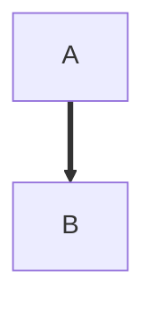

Analyses：
We will try to figure out factors related to corruption index. We will model the relationship between corruption index and some variables within countries year by year. 
These variables include government effectiveness, voice and accountability, economy stats such as GDP per capita, development indicators such as education, etc. Corruption index will also be analyzed by continents. 
We might also do a cluster analysis to classify countries. We will build models through linear regression, and use cross-validation to choose the best one.

Coding Challenges:
There are some expected coding challenges. In the regression section, there might be some difficulties to code modeling and the validation method such as cross-validation. 
```{r}


library(tidyverse)


```




